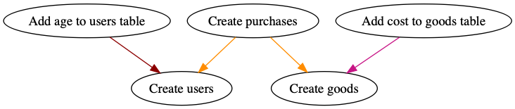
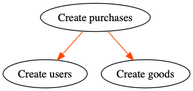

# PIG - requirement based postgres migrator

## Install

```$ go get -u github.com/bfg-dev/pig```

## Examples

You can find this files in test-data/readme-example

Users.sql

```sql

-- +pig Name: Create users
-- +pig Up
CREATE TABLE users (
    "id" serial,
    "created" timestamp DEFAULT current_timestamp,
    "fname" varchar(40),
    "sname" varchar(40),
    "email" varchar(40),
    "password" varchar(40)
);

-- +pig Down
DROP TABLE users;

```

AddAgeToUsers.sql

```sql

-- +pig Name: Add age to users table
-- +pig Requiremets: Create users
-- +pig Up
ALTER TABLE users ADD COLUMN age INTEGER;

-- +pig Down
ALTER TABLE users DROP COLUMN age;

```

Goods.sql

```sql

-- +pig Name: Create goods
-- +pig Up
CREATE TABLE goods (
    "id" serial,
    "created" timestamp DEFAULT current_timestamp,
    "name" varchar(40)
);

-- +pig Down
DROP TABLE goods;

```

AddCostToGoods.sql

```sql

-- +pig Name: Add cost to goods table
-- +pig Requiremets: Create goods
-- +pig Up
ALTER TABLE goods ADD COLUMN cost INTEGER;

-- +pig Down
ALTER TABLE goods DROP COLUMN cost;

```

Purchases.sql

```sql

-- +pig Name: Create purchases
-- +pig Requiremets: Create users, Create goods
-- +pig Up
CREATE TABLE purchases (
    "id" serial,
    "created" timestamp DEFAULT current_timestamp,
    "userId" INTEGER,
    "goodId" INTEGER
);

-- +pig Down
DROP TABLE purchases;

```

Init db

```bash

pig -dir test_data/readme-example "user=pig dbname=pig sslmode=disable" init

```

Let`s view the UP plan

```bash

$ pig -only-plan -dir test_data/readme-example "user=pig dbname=pig sslmode=disable" up
2018/12/25 16:49:07 [UP plan]
+----+---------------------+-------------------------+--------------------+----------------------------+------------+---------+
| ID |      TIMESTAMP      |          NAME           |      FILENAME      |        REQUIREMENTS        | IS APPLIED | PENDING |
+----+---------------------+-------------------------+--------------------+----------------------------+------------+---------+
| ?  | 2018-12-25 16:39:57 | Create users            | Users.sql          |                            | false      | true    |
| ?  | 2018-12-25 16:42:11 | Add age to users table  | AddAgeToUsers.sql  | Create users               | false      | true    |
| ?  | 2018-12-25 16:40:43 | Create goods            | Goods.sql          |                            | false      | true    |
| ?  | 2018-12-25 16:44:19 | Add cost to goods table | AddCostToGoods.sql | Create goods               | false      | true    |
| ?  | 2018-12-25 16:46:50 | Create purchases        | Purchases.sql      | Create users, Create goods | false      | true    |
+----+---------------------+-------------------------+--------------------+----------------------------+------------+---------+

```

Looks good. Let`s apply it!

```bash

$ pig -dir test_data/readme-example "user=pig dbname=pig sslmode=disable" up
2018/12/25 16:51:58 [UP plan]
+----+---------------------+-------------------------+--------------------+----------------------------+------------+---------+
| ID |      TIMESTAMP      |          NAME           |      FILENAME      |        REQUIREMENTS        | IS APPLIED | PENDING |
+----+---------------------+-------------------------+--------------------+----------------------------+------------+---------+
| ?  | 2018-12-25 16:39:57 | Create users            | Users.sql          |                            | false      | true    |
| ?  | 2018-12-25 16:42:11 | Add age to users table  | AddAgeToUsers.sql  | Create users               | false      | true    |
| ?  | 2018-12-25 16:40:43 | Create goods            | Goods.sql          |                            | false      | true    |
| ?  | 2018-12-25 16:44:19 | Add cost to goods table | AddCostToGoods.sql | Create goods               | false      | true    |
| ?  | 2018-12-25 16:46:50 | Create purchases        | Purchases.sql      | Create users, Create goods | false      | true    |
+----+---------------------+-------------------------+--------------------+----------------------------+------------+---------+
2018/12/25 16:51:58 [Executing:  Create users]
2018/12/25 16:51:58 [Executing:  Add age to users table]
2018/12/25 16:51:58 [Executing:  Create goods]
2018/12/25 16:51:58 [Executing:  Add cost to goods table]
2018/12/25 16:51:58 [Executing:  Create purchases]
2018/12/25 16:51:58 [All migrations executed]

```

What about status?

```bash

$ pig -dir test_data/readme-example "user=pig dbname=pig sslmode=disable" status
2018/12/25 16:56:00 [Status]
+----+---------------------+-------------------------+--------------------+----------------------------+------------+---------+
| ID |      TIMESTAMP      |          NAME           |      FILENAME      |        REQUIREMENTS        | IS APPLIED | PENDING |
+----+---------------------+-------------------------+--------------------+----------------------------+------------+---------+
| 1  | 2018-12-25 16:39:57 | Create users            | Users.sql          |                            | true       | false   |
| 2  | 2018-12-25 16:42:11 | Add age to users table  | AddAgeToUsers.sql  | Create users               | true       | false   |
| 3  | 2018-12-25 16:40:43 | Create goods            | Goods.sql          |                            | true       | false   |
| 4  | 2018-12-25 16:44:19 | Add cost to goods table | AddCostToGoods.sql | Create goods               | true       | false   |
| 5  | 2018-12-25 16:46:50 | Create purchases        | Purchases.sql      | Create users, Create goods | true       | false   |
+----+---------------------+-------------------------+--------------------+----------------------------+------------+---------+

```

Now, we can "play" with our example.

First, reset db

```bash

$ pig -dir test_data/readme-example "user=pig dbname=pig sslmode=disable" reset
2018/12/25 16:57:25 [DOWN plan]
+----+---------------------+-------------------------+--------------------+----------------------------+------------+---------+
| ID |      TIMESTAMP      |          NAME           |      FILENAME      |        REQUIREMENTS        | IS APPLIED | PENDING |
+----+---------------------+-------------------------+--------------------+----------------------------+------------+---------+
| 2  | 2018-12-25 16:42:11 | Add age to users table  | AddAgeToUsers.sql  | Create users               | true       | false   |
| 5  | 2018-12-25 16:46:50 | Create purchases        | Purchases.sql      | Create users, Create goods | true       | false   |
| 1  | 2018-12-25 16:39:57 | Create users            | Users.sql          |                            | true       | false   |
| 4  | 2018-12-25 16:44:19 | Add cost to goods table | AddCostToGoods.sql | Create goods               | true       | false   |
| 3  | 2018-12-25 16:40:43 | Create goods            | Goods.sql          |                            | true       | false   |
+----+---------------------+-------------------------+--------------------+----------------------------+------------+---------+
2018/12/25 16:57:25 [Executing:  Add age to users table]
2018/12/25 16:57:25 [Executing:  Create purchases]
2018/12/25 16:57:25 [Executing:  Create users]
2018/12/25 16:57:25 [Executing:  Add cost to goods table]
2018/12/25 16:57:25 [Executing:  Create goods]
2018/12/25 16:57:25 [All migrations executed]

```

Now, apply "Add age to users table" with note "Users"

```bash

$ pig -note "Users" -dir test_data/readme-example "user=pig dbname=pig sslmode=disable" up-migration "Add age to users table"
2018/12/25 16:58:51 [UP plan for  Add age to users table]
+----+---------------------+------------------------+-------------------+--------------+------------+---------+
| ID |      TIMESTAMP      |          NAME          |     FILENAME      | REQUIREMENTS | IS APPLIED | PENDING |
+----+---------------------+------------------------+-------------------+--------------+------------+---------+
| 1  | 2018-12-25 16:39:57 | Create users           | Users.sql         |              | false      | true    |
| 2  | 2018-12-25 16:42:11 | Add age to users table | AddAgeToUsers.sql | Create users | false      | true    |
+----+---------------------+------------------------+-------------------+--------------+------------+---------+
2018/12/25 16:58:51 [Executing:  Create users]
2018/12/25 16:58:51 [Executing:  Add age to users table]
2018/12/25 16:58:51 [All migrations executed]

```

As you can see, "Create users" automatically applied

Let`s apply "Create purchases" with note "Purchases"

```bash

$ pig -note "Purchases" -dir test_data/readme-example "user=pig dbname=pig sslmode=disable" up-migration "Create purchases"
2018/12/25 17:01:24 [UP plan for  Create purchases]
+----+---------------------+------------------+---------------+----------------------------+------------+---------+
| ID |      TIMESTAMP      |       NAME       |   FILENAME    |        REQUIREMENTS        | IS APPLIED | PENDING |
+----+---------------------+------------------+---------------+----------------------------+------------+---------+
| 3  | 2018-12-25 16:40:43 | Create goods     | Goods.sql     |                            | false      | true    |
| 5  | 2018-12-25 16:46:50 | Create purchases | Purchases.sql | Create users, Create goods | false      | true    |
+----+---------------------+------------------+---------------+----------------------------+------------+---------+
2018/12/25 17:01:24 [Executing:  Create goods]
2018/12/25 17:01:24 [Executing:  Create purchases]
2018/12/25 17:01:24 [All migrations executed]

```

History time!

```bash

$ pig -dir test_data/readme-example "user=pig dbname=pig sslmode=disable" history
2018/12/25 17:02:18 [History]
+----+---------------------+-------------------------+------------+-----------+----------+--------------------+
| ID |        WHEN         |          NAME           | IS APPLIED |   NOTE    | GIT INFO |      FILENAME      |
+----+---------------------+-------------------------+------------+-----------+----------+--------------------+
| 1  | 2018-12-25 16:51:58 | Create users            | +          | Users     |          | Users.sql          |
| 2  | 2018-12-25 16:51:58 | Add age to users table  | +          | Users     |          | AddAgeToUsers.sql  |
| 3  | 2018-12-25 16:51:58 | Create goods            | +          | Purchases |          | Goods.sql          |
| 4  | 2018-12-25 16:51:58 | Add cost to goods table | +          |           |          | AddCostToGoods.sql |
| 5  | 2018-12-25 16:51:58 | Create purchases        | +          | Purchases |          | Purchases.sql      |
| 6  | 2018-12-25 16:55:43 | Add age to users table  | -          | Users     |          | AddAgeToUsers.sql  |
| 7  | 2018-12-25 16:55:43 | Create purchases        | -          | Purchases |          | Purchases.sql      |
| 8  | 2018-12-25 16:55:43 | Create users            | -          | Users     |          | Users.sql          |
| 9  | 2018-12-25 16:55:43 | Add cost to goods table | -          |           |          | AddCostToGoods.sql |
| 10 | 2018-12-25 16:55:43 | Create goods            | -          | Purchases |          | Goods.sql          |
| 11 | 2018-12-25 16:55:56 | Create users            | +          | Users     |          | Users.sql          |
| 12 | 2018-12-25 16:55:56 | Add age to users table  | +          | Users     |          | AddAgeToUsers.sql  |
| 13 | 2018-12-25 16:55:56 | Create goods            | +          | Purchases |          | Goods.sql          |
| 14 | 2018-12-25 16:55:56 | Add cost to goods table | +          |           |          | AddCostToGoods.sql |
| 15 | 2018-12-25 16:55:56 | Create purchases        | +          | Purchases |          | Purchases.sql      |
| 16 | 2018-12-25 16:57:25 | Add age to users table  | -          | Users     |          | AddAgeToUsers.sql  |
| 17 | 2018-12-25 16:57:25 | Create purchases        | -          | Purchases |          | Purchases.sql      |
| 18 | 2018-12-25 16:57:25 | Create users            | -          | Users     |          | Users.sql          |
| 19 | 2018-12-25 16:57:25 | Add cost to goods table | -          |           |          | AddCostToGoods.sql |
| 20 | 2018-12-25 16:57:25 | Create goods            | -          | Purchases |          | Goods.sql          |
| 21 | 2018-12-25 16:58:51 | Create users            | +          | Users     |          | Users.sql          |
| 22 | 2018-12-25 16:58:51 | Add age to users table  | +          | Users     |          | AddAgeToUsers.sql  |
| 23 | 2018-12-25 17:01:24 | Create goods            | +          | Purchases |          | Goods.sql          |
| 24 | 2018-12-25 17:01:24 | Create purchases        | +          | Purchases |          | Purchases.sql      |
+----+---------------------+-------------------------+------------+-----------+----------+--------------------+

```

Now, try to rollback migrations with note "Users"

```bash

$ pig -dir test_data/readme-example "user=pig dbname=pig sslmode=disable" down-note "Users"
2018/12/25 17:06:06 [DOWN plan for Users]
+----+---------------------+------------------------+-------------------+----------------------------+------------+---------+
| ID |      TIMESTAMP      |          NAME          |     FILENAME      |        REQUIREMENTS        | IS APPLIED | PENDING |
+----+---------------------+------------------------+-------------------+----------------------------+------------+---------+
| 2  | 2018-12-25 16:42:11 | Add age to users table | AddAgeToUsers.sql | Create users               | true       | false   |
| 5  | 2018-12-25 16:46:50 | Create purchases       | Purchases.sql     | Create users, Create goods | true       | false   |
| 1  | 2018-12-25 16:39:57 | Create users           | Users.sql         |                            | true       | false   |
+----+---------------------+------------------------+-------------------+----------------------------+------------+---------+
2018/12/25 17:06:06 [Executing:  Add age to users table]
2018/12/25 17:06:06 [Executing:  Create purchases]
2018/12/25 17:06:06 [Executing:  Create users]
2018/12/25 17:06:06 [All migrations executed]

```

All "Users" migrations have been rolled back! Why? Because of requirements :)

Need some visualization? Install [graphviz](https://www.graphviz.org/download/) and run

```bash

$ pig -dir test_data/readme-example "user=pig dbname=pig sslmode=disable" graph scheme.png

```



Or you can "draw" one migration

```bash

$ pig -dir test_data/readme-example "user=pig dbname=pig sslmode=disable" graph-migration "Create purchases"

```



## Features

* Any file name, no strong sequence
* No dead migrations. You can rollback any migration without corresponding sql file
* You can safely edit sql files, just rollback and up it again
* Easy usage with CI (you can add git information and use it for mass rollback)
* Colors in terminal :)
* Visualization of requirements

## File format

Write your SQL queries in files with any name and extension ".sql"

Text must/may contain some notations:

* ```-- +pig Name: <Any name>``` : (optional) name of migration. Defaults to file name without extension. This name used in requirements notations.
* ```-- +pig Requiremets: <Requirement 1>, <Requirement 2>``` : (optional) comma separated requirements list
* ```-- +pig Up``` : starts "UP" block of migration
* ```-- +pig Down``` : starts "DOWN" block of migration
* ```-- +pig StatementBegin``` : starts block with "complex" sql code
* ```-- +pig StatementEnd``` : ends block with "complex" sql code
* ```-- +pig NO TRANSACTION``` : Disables transaction mode for whole migration

## Options

* **dir** folder with migrations
* **note** any string (applied only on UP)
* **gitinfo** any string, but recommended branch/tag name (applied only on UP)
* **only-plan** show plan wuthout execution
* **list-view** print migrations as list

## Commands

* **init** Init database
* **up** Up all available migrations
* **up-migration NAME** Up a specific NAME
* **up-gitinfo GITINFO** Up a specific GITINFO (affects only known migrations)
* **up-note NOTE** Up a specific NOTE (affects only known migrations)
* **down-migration NAME** Roll back a specific NAME
* **down-gitinfo GITINFO** Roll back a specific GITINFO
* **down-note NOTE** Roll back a specific NOTE
* **reset** Roll back all migrations
* **status** Dump the migration status
* **history** Show migration history
* **history-migration NAME** Show history for a specific NAME
* **history-gitinfo GITINFO** Show history for a specific GITINFO
* **history-note NOTE** Show history for a specific NOTE
* **graph [pngname]** Draw png graph. (default pngname is output.png)
* **graph-migration NAME [pngname]** Draw png graph for specific NAME (default pngname is NAME.png)
